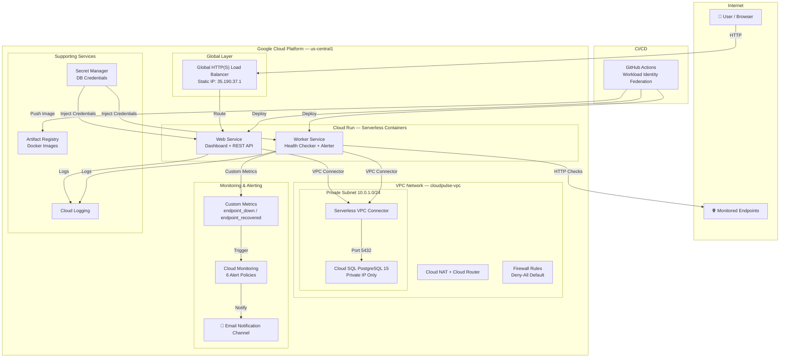

# CloudPulse — Cloud-Native Uptime Monitoring Platform

> A production-grade, serverless uptime monitoring service built on **Google Cloud Platform**. CloudPulse continuously monitors the health of your websites and APIs, tracks response times, calculates uptime percentages, and alerts you when services go down — all deployed via **Infrastructure as Code** with **zero manual console clicks**.

> The entire infrastructure is defined using **Terraform** (12 modular modules) and deployed via a professional **CI/CD pipeline** with GitHub Actions and **Workload Identity Federation** (keyless authentication).

---

## Architecture Diagram



---

## Key Features

| Feature | Description |
|---------|-------------|
| **Automated Health Monitoring** | Continuously pings endpoints at configurable intervals (1–30 min). Records HTTP status codes, response times, TLS errors, and timeouts. |
| **Real-Time Dashboard** | Premium dark-theme web UI with live status indicators (🟢 UP / 🔴 DOWN), Chart.js response time graphs, and uptime percentages (24h / 7d). |
| **Endpoint Alerting** | Detects UP→DOWN and first-time DOWN events. Writes custom Cloud Monitoring metrics that trigger email alerts within 60 seconds. |
| **Infrastructure Alerting** | 6 alert policies for site outages, 5xx errors, SQL CPU, and SQL disk usage — all routed to email. |
| **REST API + Swagger** | Full CRUD API at `/api/endpoints/` with auto-generated OpenAPI documentation at `/api/docs`. |
| **Serverless & Auto-Scaling** | Built on Cloud Run — scales to zero when idle, handles traffic bursts automatically. |
| **Private Database** | Cloud SQL PostgreSQL 15 on a private VPC IP. No public database endpoint. Automated daily backups. |
| **Infrastructure as Code** | 12 modular Terraform modules. Zero manual configuration. Reproducible in minutes. |
| **DevSecOps CI/CD** | 4-stage GitHub Actions pipeline: validate → infra → build → deploy. Keyless auth via WIF. |
| **Security Hardened** | Least-privilege IAM, Secret Manager, VPC Flow Logs, firewall deny-all, non-root containers. |

---

## Technology Stack

| Category | Technology |
|----------|-----------|
| **Cloud Provider** | Google Cloud Platform (GCP) |
| **Compute** | Cloud Run (serverless containers) |
| **Database** | Cloud SQL for PostgreSQL 15 (private IP, managed, auto-backups) |
| **Networking** | Custom VPC, Serverless VPC Connector, Cloud NAT, Cloud Router |
| **Load Balancing** | Global External HTTP(S) Load Balancer, Serverless NEG |
| **Security** | IAM Service Accounts, Secret Manager, Firewall Rules, VPC Flow Logs |
| **Monitoring** | Cloud Monitoring (6 alert policies, custom metrics, uptime checks) |
| **Container Registry** | Artifact Registry (with auto-cleanup lifecycle policy) |
| **IaC** | Terraform 1.6+ (modular architecture, GCS remote state) |
| **CI/CD** | GitHub Actions, Workload Identity Federation (OIDC — keyless) |
| **Application** | Python 3.11, FastAPI (async), SQLAlchemy 2.0, HTTPX |
| **Frontend** | Jinja2 Templates, Chart.js, Vanilla CSS (premium dark theme) |
| **Testing** | pytest (18 unit tests), pytest-asyncio, pytest-httpx |
| **Security Scanning** | TFLint, Checkov |

---

## Project Structure

```
.
├── .github/workflows/
│   ├── deploy-dev.yml                # 4-stage CI/CD: validate → infra → build → deploy
│   └── destroy-dev.yml               # 3-stage teardown with safety confirmation
│
├── environments/
│   └── dev/
│       ├── main.tf                   # Root module — composes all 12 modules
│       ├── variables.tf              # Input variables with validation
│       ├── outputs.tf                # Dashboard URL, LB IP, registry URL
│       ├── backend.tf                # GCS remote state configuration
│       ├── providers.tf              # Google provider v6 + version constraints
│       └── terraform.tfvars          # Environment-specific values
│
├── modules/
│   ├── apis/                         # Enable 12 required GCP APIs
│   ├── vpc/                          # VPC, subnet, Private Service Access peering
│   ├── nat/                          # Cloud Router + Cloud NAT
│   ├── vpc_connector/                # Serverless VPC Connector (e2-micro)
│   ├── firewall/                     # Deny-all default + health check + internal rules
│   ├── cloud_sql/                    # PostgreSQL 15 (private IP, auto-backup, PIT recovery)
│   ├── secrets/                      # Secret Manager for DB password
│   ├── artifact_registry/            # Docker repo + 30-day untagged cleanup
│   ├── iam/                          # 2 service accounts + least-privilege bindings
│   ├── cloud_run/                    # Web + Worker services (scale-to-zero)
│   ├── load_balancer/                # Global HTTP(S) LB + static IP + serverless NEG
│   └── monitoring/                   # Email channel, uptime check, 6 alert policies, custom metrics
│
├── src/
│   ├── main.py                       # FastAPI application entry point
│   ├── worker.py                     # Background health checker + alert dispatcher
│   ├── config.py                     # Pydantic settings (from env vars)
│   ├── database.py                   # SQLAlchemy engine + session management
│   ├── models.py                     # ORM models (Endpoint, HealthCheck)
│   ├── Dockerfile                    # Multi-stage build, non-root user
│   ├── requirements.txt              # Python dependencies (pinned versions)
│   ├── routes/
│   │   ├── health.py                 # /api/health — LB + Cloud Run health probes
│   │   ├── endpoints.py              # CRUD REST API for monitored endpoints
│   │   └── dashboard.py              # Server-rendered HTML dashboard
│   ├── services/
│   │   ├── checker.py                # Async HTTP health check logic (HTTPX)
│   │   └── alerts.py                 # Cloud Monitoring custom metric writer
│   ├── templates/
│   │   ├── base.html                 # Shared layout with navigation
│   │   ├── dashboard.html            # Main monitoring dashboard (Chart.js)
│   │   └── endpoint_detail.html      # Endpoint detail with response time chart
│   └── static/
│       └── style.css                 # Premium dark theme CSS
│
├── test/
│   └── test_api.py                   # 18 pytest unit tests (health, CRUD, uptime)
│
├── docs/
│   ├── ARCHITECTURE.md               # Architecture Decision Record (ADR)
│   └── RUNBOOK.md                    # Operations runbook
│
├── docker-compose.yml                # Local development (web + worker + PostgreSQL)
├── scripts/
│   └── init_db.sql                   # Reference DB schema
│
└── .gitignore
```

---

## Prerequisites

| Requirement | Version | Purpose |
|-------------|---------|---------|
| Google Cloud Account | — | Active billing account (free trial $300 works) |
| `gcloud` CLI | Latest | GCP authentication and project setup |
| Terraform | ≥ 1.6.0 | Infrastructure as Code |
| Docker | Latest | Local development with docker-compose |
| Python | ≥ 3.11 | Running tests locally |
| GitHub Account | — | CI/CD pipeline via Actions |

---

## Setup and Deployment

### 1. GCP Project Configuration

```bash
# Set your project ID
export PROJECT_ID="cloudpulse-uptime-dev"

# Create the project (if not exists)
gcloud projects create $PROJECT_ID --name="CloudPulse Uptime Monitor"

# Set the active project
gcloud config set project $PROJECT_ID

# Link billing account
gcloud billing accounts list
gcloud billing projects link $PROJECT_ID --billing-account=BILLING_ACCOUNT_ID
```

### 2. Create Terraform State Bucket

```bash
# Create a GCS bucket for Terraform remote state
gsutil mb -p $PROJECT_ID -l us-central1 gs://cloudpulse-terraform-state-dev

# Enable versioning for state recovery
gsutil versioning set on gs://cloudpulse-terraform-state-dev
```

### 3. Configure Workload Identity Federation (Keyless CI/CD)

```bash
# Create a Workload Identity Pool
gcloud iam workload-identity-pools create "github-pool" \
  --project=$PROJECT_ID \
  --location="global" \
  --display-name="GitHub Actions Pool"

# Create a Workload Identity Provider
gcloud iam workload-identity-pools providers create-oidc "github-provider" \
  --project=$PROJECT_ID \
  --location="global" \
  --workload-identity-pool="github-pool" \
  --display-name="GitHub Provider" \
  --attribute-mapping="google.subject=assertion.sub,attribute.repository=assertion.repository" \
  --attribute-condition="assertion.repository=='YOUR_GITHUB_USER/CloudPulse-Uptime-Monitor'" \
  --issuer-uri="https://token.actions.githubusercontent.com"

# Create the GitHub service account
gcloud iam service-accounts create cloudpulse-dev-github-sa \
  --project=$PROJECT_ID \
  --display-name="GitHub Actions SA"

# Grant required roles (all 8 needed for full lifecycle)
SA="serviceAccount:cloudpulse-dev-github-sa@${PROJECT_ID}.iam.gserviceaccount.com"
for ROLE in \
  roles/editor \
  roles/compute.networkAdmin \
  roles/servicenetworking.networksAdmin \
  roles/run.admin \
  roles/iam.serviceAccountAdmin \
  roles/iam.serviceAccountUser \
  roles/resourcemanager.projectIamAdmin \
  roles/secretmanager.admin; do
  gcloud projects add-iam-policy-binding $PROJECT_ID --member="$SA" --role="$ROLE"
done

# Allow the GitHub repo to impersonate the service account
PROJECT_NUMBER=$(gcloud projects describe $PROJECT_ID --format="value(projectNumber)")
gcloud iam service-accounts add-iam-policy-binding \
  "cloudpulse-dev-github-sa@${PROJECT_ID}.iam.gserviceaccount.com" \
  --project=$PROJECT_ID \
  --role="roles/iam.workloadIdentityUser" \
  --member="principalSet://iam.googleapis.com/projects/${PROJECT_NUMBER}/locations/global/workloadIdentityPools/github-pool/attribute.repository/YOUR_GITHUB_USER/CloudPulse-Uptime-Monitor"
```

### 4. Update Configuration Files

| File | What to Change |
|------|---------------|
| `environments/dev/terraform.tfvars` | `project_id`, `alert_email` |
| `environments/dev/backend.tf` | GCS state bucket name |
| `.github/workflows/deploy-dev.yml` | `WIF_PROVIDER`, `WIF_SERVICE_ACCOUNT` |
| `.github/workflows/destroy-dev.yml` | Same WIF values |

### 5. Deploy

```bash
# Push to main branch — the CI/CD pipeline handles everything automatically
git add . && git commit -m "Initial deployment" && git push origin main
```

The 4-stage pipeline will:
1. **Validate** — `terraform fmt`, `tflint`, `checkov`, `pytest`
2. **Infrastructure** — Provision APIs, VPC, Cloud SQL, IAM, Artifact Registry
3. **Build** — Docker build → push to Artifact Registry (SHA-tagged + latest)
4. **Deploy** — Deploy Cloud Run services, Load Balancer, and Monitoring

---

## How to Use

### Access the Dashboard

```bash
# Get the dashboard URL after deployment
cd environments/dev && terraform output dashboard_url
```

Open the URL in your browser to see the monitoring dashboard.

### Add an Endpoint via the Dashboard

1. Navigate to the dashboard URL
2. Enter a **name** and **URL** in the "Add New Monitor" form
3. Select a check interval (1–30 minutes)
4. Click **"+ Add Monitor"**

### Add an Endpoint via the API

```bash
# Create a new monitored endpoint
curl -X POST http://LOAD_BALANCER_IP/api/endpoints/ \
  -H "Content-Type: application/json" \
  -d '{"name": "Google", "url": "https://www.google.com", "check_interval": 300}'

# List all endpoints
curl http://LOAD_BALANCER_IP/api/endpoints/

# Get endpoint details with health history
curl http://LOAD_BALANCER_IP/api/endpoints/1/history

# Delete an endpoint
curl -X DELETE http://LOAD_BALANCER_IP/api/endpoints/1
```

### View API Documentation

Navigate to `http://LOAD_BALANCER_IP/api/docs` for interactive Swagger/OpenAPI documentation.

---

## Alerting System

CloudPulse has two layers of alerting:

### Layer 1: Endpoint Alerts (Application-Level)

When the worker detects that a monitored endpoint has gone **DOWN**:

```
Endpoint goes DOWN
  → Worker detects UP→DOWN transition (or first-time DOWN)
  → Worker writes custom metric to Cloud Monitoring
     (custom.googleapis.com/cloudpulse/endpoint_down)
  → Alert policy fires
  → Email notification sent to configured address
```

### Layer 2: Infrastructure Alerts (Platform-Level)

| Alert Policy | Trigger | Duration |
|-------------|---------|----------|
| **Site Down** | LB uptime check fails | 5 min |
| **Endpoint Down** | Custom metric from worker | Immediate |
| **Cloud Run 5xx** | >5 server errors | 5 min |
| **Cloud SQL CPU > 80%** | CPU utilization | 5 min |
| **Cloud SQL Disk > 80%** | Disk utilization | 5 min |

All alerts are sent to the email configured in `terraform.tfvars` → `alert_email`.

---

## Testing

### Run Unit Tests Locally

```bash
# Create virtual environment
python3 -m venv .venv
source .venv/bin/activate

# Install dependencies
pip install -r src/requirements.txt

# Run tests
cd test && PYTHONPATH=../src python -m pytest test_api.py -v
```

**18 tests** covering:
- Health check endpoint
- CRUD operations (create, read, update, delete)
- Default values and partial updates
- History retrieval
- Uptime percentage calculations (100%, mixed, empty)

### Local Development with Docker Compose

```bash
# Start all services (web + worker + PostgreSQL)
docker compose up --build

# Dashboard available at http://localhost:8080
# Worker health at http://localhost:8001/health
```

---

## Destroying the Infrastructure

1. Navigate to the **Actions** tab in your GitHub repository
2. Select the **"Destroy CloudPulse - Dev"** workflow
3. Click **"Run workflow"**
4. Type `destroy all resources` when prompted

The 3-stage destroy pipeline will:
1. Apply config changes (deletion policies for clean removal)
2. Destroy Cloud Run services first (release database connections)
3. Destroy remaining infrastructure (SQL, VPC, NAT, etc.)

---

## Security Architecture

| Control | Implementation |
|---------|----------------|
| **Authentication** | Workload Identity Federation (OIDC — no service account keys) |
| **Secrets** | Secret Manager (DB password never in code or CI vars) |
| **Network Isolation** | Cloud SQL on private VPC IP only |
| **Ingress Control** | Cloud Run accepts traffic only from Load Balancer |
| **Firewall** | Deny-all default rule + explicit allow for health checks |
| **IAM** | 2 dedicated service accounts with least-privilege roles |
| **Container Security** | Non-root user in Docker, multi-stage build |
| **Audit** | VPC Flow Logs enabled, Cloud Logging for all services |
| **State Security** | Terraform state in GCS with versioning |

---

## Cost Estimate

| Resource | Monthly Cost |
|----------|-------------|
| Cloud Run (web + worker, scale-to-zero) | ~$10-16 |
| Cloud SQL (db-f1-micro, private IP) | ~$8-10 |
| Global HTTP(S) Load Balancer | ~$18 |
| VPC Connector (e2-micro × 2) | ~$6 |
| Cloud NAT + Monitoring + Logging | ~$2-4 |
| **Total** | **~$45-55/month** |

> With the $300 GCP free trial credit, this runs for **5-6 months** at no cost.

---

## Future Improvements

| Improvement | Description |
|-------------|-------------|
| **HTTPS + Custom Domain** | Cloud DNS + Google-managed SSL certificate |
| **Authentication** | Firebase Auth or Identity-Aware Proxy (IAP) |
| **Slack/PagerDuty Alerts** | Additional notification channels via Pub/Sub |
| **Multi-Region Checks** | Deploy workers in multiple regions for global coverage |
| **Grafana Dashboard** | Add Grafana with Cloud Monitoring as data source |
| **Cloud Armor WAF** | Web Application Firewall rules on the Load Balancer |
| **Multi-Environment** | Add staging/production with Terraform workspaces |

---

## License

This project was built as a comprehensive demonstration of professional cloud engineering, infrastructure as code, containerization, and DevSecOps practices on Google Cloud Platform.

**Author:** Yisak Mesifin  
**GitHub:** [yisakm9/CloudPulse-Uptime-Monitor](https://github.com/yisakm9/CloudPulse-Uptime-Monitor)
