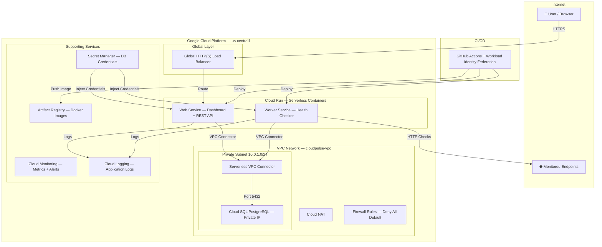

# CloudPulse — Cloud-Native Uptime Monitoring Platform

> A production-grade, serverless uptime monitoring service built on **Google Cloud Platform**. CloudPulse continuously monitors the health of your websites and APIs, tracks response times, calculates uptime percentages, and alerts you when services go down.

> The entire infrastructure is defined as code using **Terraform** and deployed via a professional **CI/CD pipeline** with GitHub Actions and **Workload Identity Federation** (keyless authentication).

## Architecture Diagram



## Key Features

-   **Automated Health Monitoring:** Continuously pings your endpoints at configurable intervals (1–30 min) and records HTTP status codes, response times, and errors.
-   **Real-Time Dashboard:** A premium dark-theme web UI showing live status (🟢 UP / 🔴 DOWN), response time charts (Chart.js), and uptime percentages (24h / 7d / 30d).
-   **Downtime Detection & Alerting:** Detects UP→DOWN transitions and triggers alerts via Cloud Monitoring notification channels.
-   **REST API with Swagger Docs:** Full CRUD API for managing monitored endpoints, with auto-generated OpenAPI documentation at `/api/docs`.
-   **Serverless & Auto-Scaling:** Built entirely on Cloud Run — scales to zero when idle, scales up under load.
-   **Database Isolation:** Cloud SQL PostgreSQL on a private IP, accessible only through the VPC Connector. No public database endpoint.
-   **Infrastructure as Code:** 12 modular Terraform modules covering VPC, Cloud SQL, Cloud Run, Load Balancer, IAM, and monitoring.
-   **DevSecOps CI/CD:** GitHub Actions pipeline with TFLint, Checkov security scanning, Docker build, and automated deployment — all using keyless Workload Identity Federation.
-   **Security Hardened:** Least-privilege service accounts, Secret Manager for credentials, VPC Flow Logs, firewall deny-all default, and non-root Docker containers.

## Technology Stack

| Category | Technology / Service |
| --- | --- |
| **Cloud Provider** | Google Cloud Platform (GCP) |
| **Compute** | Cloud Run (serverless containers) |
| **Database** | Cloud SQL for PostgreSQL (private IP, managed) |
| **Networking** | VPC, Serverless VPC Connector, Cloud NAT, Cloud Router |
| **Load Balancing** | Global External HTTP(S) Load Balancer, Serverless NEG |
| **Security** | IAM Service Accounts, Secret Manager, Firewall Rules, VPC Flow Logs |
| **Monitoring** | Cloud Monitoring (alerts, uptime checks), Cloud Logging |
| **Container Registry** | Artifact Registry |
| **IaC** | Terraform (modular architecture, GCS remote state) |
| **CI/CD** | GitHub Actions, Workload Identity Federation (OIDC) |
| **Application** | Python 3.11, FastAPI, SQLAlchemy, HTTPX |
| **Frontend** | Jinja2 Templates, Chart.js, Vanilla CSS |
| **Security Scanning** | TFLint, Checkov |

## Project Structure

```
.
├── .github/workflows/
│   ├── deploy-dev.yml               # CI/CD: lint → build → push → deploy
│   └── destroy-dev.yml              # Manual teardown with confirmation
│
├── environments/
│   └── dev/
│       ├── main.tf                  # Root module — composes all 12 modules
│       ├── variables.tf             # Input variables
│       ├── outputs.tf               # Dashboard URL, LB IP, etc.
│       ├── backend.tf               # GCS remote state configuration
│       ├── providers.tf             # Google provider + version constraints
│       └── terraform.tfvars         # Environment-specific values
│
├── modules/
│   ├── apis/                        # Enable required GCP APIs
│   ├── vpc/                         # VPC, subnet, Private Service Access
│   ├── nat/                         # Cloud Router + Cloud NAT
│   ├── vpc_connector/               # Serverless VPC Connector
│   ├── firewall/                    # Deny-all default + health check rules
│   ├── cloud_sql/                   # PostgreSQL instance (private IP)
│   ├── secrets/                     # Secret Manager for DB password
│   ├── artifact_registry/           # Docker image repository
│   ├── iam/                         # Service accounts + least-privilege roles
│   ├── cloud_run/                   # Web + Worker services
│   ├── load_balancer/               # Global HTTP(S) LB + serverless NEG
│   └── monitoring/                  # Alert policies + uptime checks
│
├── src/
│   ├── main.py                      # FastAPI application entry point
│   ├── worker.py                    # Background health check worker
│   ├── config.py                    # Pydantic settings (from env vars)
│   ├── database.py                  # SQLAlchemy engine + session management
│   ├── models.py                    # ORM models (Endpoint, HealthCheck)
│   ├── Dockerfile                   # Multi-stage build, non-root user
│   ├── requirements.txt             # Python dependencies
│   ├── routes/
│   │   ├── health.py                # /api/health — LB + Cloud Run probes
│   │   ├── endpoints.py             # CRUD REST API for endpoints
│   │   └── dashboard.py             # Server-rendered HTML dashboard
│   ├── services/
│   │   └── checker.py               # Async HTTP health check logic
│   ├── templates/
│   │   ├── base.html                # Shared layout with navigation
│   │   ├── dashboard.html           # Main monitoring dashboard
│   │   └── endpoint_detail.html     # Endpoint detail with charts
│   └── static/
│       └── style.css                # Premium dark theme styles
│
├── scripts/
│   └── init_db.sql                  # Reference DB schema
│
└── .gitignore
```

## Prerequisites

1.  **Google Cloud Account** with an active billing account (free trial $300 credit works).
2.  **GCP Project** created (e.g., `cloudpulse-uptime-dev`).
3.  **Terraform** CLI installed locally (`>= 1.5.0`).
4.  **gcloud** CLI installed and authenticated.
5.  **Docker** installed locally (for local development).
6.  **GitHub Repository** for CI/CD pipeline.

## Setup and Deployment

### 1. GCP Project Configuration

```bash
# Set your project ID
export PROJECT_ID="cloudpulse-uptime-dev"

# Create the project (if not exists)
gcloud projects create $PROJECT_ID --name="CloudPulse Uptime Monitor"

# Set the active project
gcloud config set project $PROJECT_ID

# Link billing account
gcloud billing accounts list
gcloud billing projects link $PROJECT_ID --billing-account=BILLING_ACCOUNT_ID
```

### 2. Create Terraform State Bucket

```bash
# Create a GCS bucket for Terraform remote state
gsutil mb -p $PROJECT_ID -l us-central1 gs://cloudpulse-terraform-state-dev

# Enable versioning for state recovery
gsutil versioning set on gs://cloudpulse-terraform-state-dev
```

### 3. Configure Workload Identity Federation (Keyless GitHub Auth)

```bash
# Create a Workload Identity Pool
gcloud iam workload-identity-pools create "github-pool" \
  --project=$PROJECT_ID \
  --location="global" \
  --display-name="GitHub Actions Pool"

# Create a Workload Identity Provider
gcloud iam workload-identity-pools providers create-oidc "github-provider" \
  --project=$PROJECT_ID \
  --location="global" \
  --workload-identity-pool="github-pool" \
  --display-name="GitHub Provider" \
  --attribute-mapping="google.subject=assertion.sub,attribute.repository=assertion.repository" \
  --issuer-uri="https://token.actions.githubusercontent.com"

# Allow the GitHub repo to impersonate the service account
gcloud iam service-accounts add-iam-policy-binding \
  "cloudpulse-dev-github-sa@${PROJECT_ID}.iam.gserviceaccount.com" \
  --project=$PROJECT_ID \
  --role="roles/iam.workloadIdentityUser" \
  --member="principalSet://iam.googleapis.com/projects/PROJECT_NUMBER/locations/global/workloadIdentityPools/github-pool/attribute.repository/yisakm9/CloudPulse-Uptime-Monitor"
```

### 4. Update Configuration

-   Update `environments/dev/terraform.tfvars` with your project ID and email.
-   Update `environments/dev/backend.tf` with your state bucket name.
-   Update `.github/workflows/deploy-dev.yml` with your WIF provider and service account.

### 5. Deploy

```bash
# Push to main branch — the CI/CD pipeline handles everything
git add .
git commit -m "Initial CloudPulse deployment"
git push origin main
```

The pipeline will: lint → security scan → build Docker image → push to Artifact Registry → Terraform apply → deploy Cloud Run services.

## How to Use

### 1. Access the Dashboard

After deployment, get your dashboard URL:

```bash
cd environments/dev
terraform output dashboard_url
```

Open the URL in your browser to see the monitoring dashboard.

### 2. Add an Endpoint to Monitor

Use the web dashboard form, or the REST API:

```bash
curl -X POST http://LOAD_BALANCER_IP/api/endpoints/ \
  -H "Content-Type: application/json" \
  -d '{"name": "Google", "url": "https://www.google.com", "check_interval": 300}'
```

### 3. View API Documentation

Navigate to `http://LOAD_BALANCER_IP/api/docs` for interactive Swagger documentation.

## Destroying the Infrastructure

1.  Navigate to the **Actions** tab in your GitHub repository.
2.  Select the **"Destroy CloudPulse - Dev"** workflow.
3.  Click **"Run workflow"**.
4.  Type `destroy all resources` when prompted.
5.  The pipeline will execute `terraform destroy` and remove all resources.

## Cost Estimate

| Resource | Monthly Cost |
|----------|-------------|
| Cloud Run (web + worker) | ~$10-16 |
| Cloud SQL (db-f1-micro) | ~$8-10 |
| Global HTTP(S) LB | ~$18 |
| VPC Connector (e2-micro × 2) | ~$6 |
| Cloud NAT + others | ~$2-4 |
| **Total** | **~$45-55/month** |

> With $300 GCP free trial credit, this runs for **5-6 months** at no cost.

## Future Improvements

-   **HTTPS with Custom Domain:** Add Cloud DNS + Google-managed SSL certificate.
-   **Authentication:** Integrate Firebase Auth or Identity-Aware Proxy (IAP).
-   **Slack/PagerDuty Alerts:** Extend notification channels via Pub/Sub.
-   **Multi-Region Checks:** Deploy workers in multiple regions for global coverage.
-   **Kubernetes Migration:** Migrate to GKE Autopilot for Kubernetes experience.
-   **Grafana Dashboard:** Add Grafana with Cloud Monitoring data source.
-   **Cloud Armor WAF:** Add Web Application Firewall rules to the Load Balancer.

---

This project was built as a comprehensive demonstration of professional cloud engineering, containerization, and DevOps practices on Google Cloud Platform.
